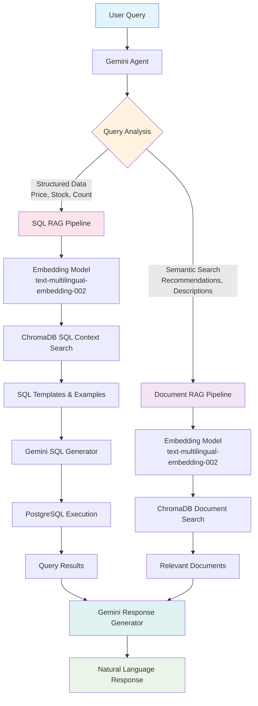

# Chat Bot Lang4J

<div align="center">

**Intelligent Chatbot with RAG and Text-to-SQL Capabilities**

[](https://openjdk.org/projects/jdk/17/)
[](https://spring.io/projects/spring-boot)
[](https://github.com/langchain4j/langchain4j)
[](https://opensource.org/licenses/MIT)

</div>

---

## Giới thiệu

Dự án chatbot được xây dựng với **Spring Boot** và **LangChain4j**, triển khai hệ thống **Retrieval-Augmented Generation (RAG)** với hai luồng xử lý thông minh. Chatbot có khả năng:

- **SQL RAG**: Sử dụng RAG để tìm kiếm SQL templates/examples, sau đó generate SQL queries cho dữ liệu có cấu trúc
- **Document RAG**: Tìm kiếm ngữ nghĩa trong ChromaDB để trả lời câu hỏi mô tả và gợi ý

---

## Kiến trúc



---

## Luồng hoạt động

### 1. Data Ingestion (RAG Pipeline)

```
PostgreSQL → Embedding Model → ChromaDB Vector Store
```

1. **Đọc dữ liệu**: Lấy thông tin sản phẩm từ PostgreSQL
2. **Tạo Embeddings**: Sử dụng `text-multilingual-embedding-002` để vector hóa
3. **Lưu trữ Vector**: Lưu vào ChromaDB cho semantic search

### 2. Query Processing

```
User Question → Query Analysis → Pipeline Selection → RAG Retrieval → SQL/Document Processing → Response Generation
```

| Pipeline | Khi nào sử dụng | Process | Ví dụ |
|----------|----------------|---------|-------|
| **SQL RAG** | Dữ liệu có cấu trúc, số liệu | RAG SQL templates → Generate SQL → Execute | "Giá iPhone 15 là bao nhiêu?" |
| **Document RAG** | Câu hỏi ngữ nghĩa, gợi ý | RAG documents → Context retrieval | "Smartphone nào phù hợp cho sinh viên?" |

### 3. RAG Customization

- **Top K**: Số lượng documents truy xuất
- **Minimum Score**: Ngưỡng similarity threshold
- **Re-ranking**: Cross-encoder để cải thiện độ chính xác

---

## Tính năng chính

- **Agent thông minh**: Tự động lựa chọn pipeline phù hợp (SQL RAG, Document RAG)
- **SQL RAG**: Sử dụng RAG để tìm SQL templates và generate queries an toàn
- **Document RAG**: Semantic search trên knowledge base được vector hóa
- **Multi-model**: Tích hợp Gemini + Embedding models cho cả hai pipeline

---

## Tech Stack

<table>
<tr>
<td><strong>Backend</strong></td>
<td>Spring Boot 3.4.5, Java 17, Maven</td>
</tr>
<tr>
<td><strong>AI/LLM</strong></td>
<td>LangChain4j 1.0.0, Google Gemini (Vertex AI), text-multilingual-embedding-002</td>
</tr>
<tr>
<td><strong>Database</strong></td>
<td>PostgreSQL, ChromaDB (Testcontainers)</td>
</tr>
<tr>
<td><strong>Tools</strong></td>
<td>Docker, Lombok</td>
</tr>
</table>

---

## Prerequisites

| Tool | Version | Purpose |
|------|---------|---------|
| **Java JDK** | 17+ | [Download](https://www.oracle.com/java/technologies/javase/jdk17-archive-downloads.html) |
| **Maven** | 3.8+ | [Download](https://maven.apache.org/download.cgi) |
| **Docker** | Latest | [Download](https://www.docker.com/products/docker-desktop/) |
| **PostgreSQL** | 13+ | [Download](https://www.postgresql.org/download/) |

---

## Configuration

### 1. PostgreSQL Database

Cấu hình trong `src/main/resources/application.properties`:

```properties
# Database Configuration
spring.datasource.url=jdbc:postgresql://localhost:5432/your_database
spring.datasource.username=your_username
spring.datasource.password=your_password
spring.jpa.hibernate.ddl-auto=update

# JPA Settings
spring.jpa.show-sql=true
spring.jpa.properties.hibernate.format_sql=true
```

### 2. ChromaDB (Vector Database)

ChromaDB được quản lý tự động thông qua **Testcontainers**. Chỉ cần đảm bảo Docker đang chạy.

### 3. Google Vertex AI Setup

#### 🔧 **Bước 1: Tạo Google Cloud Project**

```bash
# Tạo project mới
gcloud projects create your-project-id --name="Chatbot Project"

# Set project làm default
gcloud config set project your-project-id

# Kiểm tra project hiện tại
gcloud config get-value project
```

#### 🔧 **Bước 2: Enable Required APIs**

```bash
# Enable Vertex AI API
gcloud services enable aiplatform.googleapis.com

# Enable Compute Engine API (required)
gcloud services enable compute.googleapis.com

# Kiểm tra APIs đã enable
gcloud services list --enabled --filter="aiplatform.googleapis.com OR compute.googleapis.com"
```

#### 🔧 **Bước 3: Authentication Setup**

**Option A: Application Default Credentials (Recommended for Development)**

```bash
# Login với user account
gcloud auth application-default login

# Verify authentication
gcloud auth application-default print-access-token
```

**Option B: Service Account (Recommended for Production)**

```bash
# Tạo service account
gcloud iam service-accounts create chatbot-service-account \
    --description="Service account for chatbot application" \
    --display-name="Chatbot Service Account"

# Gán quyền Vertex AI User
gcloud projects add-iam-policy-binding your-project-id \
    --member="serviceAccount:chatbot-service-account@your-project-id.iam.gserviceaccount.com" \
    --role="roles/aiplatform.user"

# Tạo và download key file
gcloud iam service-accounts keys create ~/chatbot-service-key.json \
    --iam-account=chatbot-service-account@your-project-id.iam.gserviceaccount.com

# Set environment variable
export GOOGLE_APPLICATION_CREDENTIALS="$HOME/chatbot-service-key.json"
```

#### 🔧 **Bước 4: Configure Application**

Thêm vào `application.properties`:

```properties
# Google Cloud Configuration
google.cloud.project-id=your-project-id
google.cloud.location=us-central1

# LangChain4j Vertex AI Configuration
langchain4j.vertex-ai.project-id=${google.cloud.project-id}
langchain4j.vertex-ai.location=${google.cloud.location}
langchain4j.vertex-ai.model-name=gemini-pro

# Embedding Model Configuration
langchain4j.embedding.model=text-multilingual-embedding-002
langchain4j.embedding.dimension=768


#### 📊 **Vertex AI Pricing** (Reference)

| Model | Input (per 1K tokens) | Output (per 1K tokens) |
|-------|----------------------|------------------------|
| Gemini Pro | $0.000125 | $0.000375 |
| text-multilingual-embedding-002 | $0.0001 | - |

---


## Troubleshooting

### Common Issues

**🔴 Vertex AI Authentication Error**
```bash
# Re-authenticate
gcloud auth application-default revoke
gcloud auth application-default login
```

**🔴 Project ID Not Found**
```bash
# Verify project exists and is accessible
gcloud projects describe your-project-id
```

**🔴 API Not Enabled**
```bash
# Check enabled APIs
gcloud services list --enabled --filter="aiplatform"
```

---

</div>
