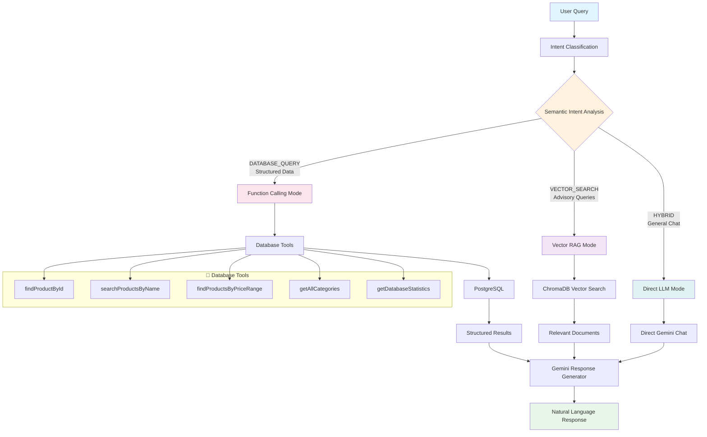

# Chat Bot Lang4J

<div align="center">

**Intelligent E-commerce Chatbot with Function Calling & Intent Classification**

[](https://openjdk.org/projects/jdk/17/)
[](https://spring.io/projects/spring-boot)
[](https://github.com/langchain4j/langchain4j)
[](https://www.postgresql.org/)
[](https://opensource.org/licenses/MIT)

</div>

---

## 🎯 Giới thiệu

Hệ thống chatbot thông minh cho e-commerce được xây dựng với **Spring Boot** và **LangChain4j**. Chatbot có khả năng:

- **🤖 Function Calling**: Truy vấn database PostgreSQL thông qua các function tools
- **🧠 Intent Classification**: Phân loại ý định người dùng với semantic embedding
- **🔍 Multi-mode Interaction**: 4 chế độ chat khác nhau cho các trường hợp sử dụng khác nhau
- **📊 Database Integration**: Quản lý sản phẩm và danh mục hoàn chỉnh

---

## 🏗️ Kiến trúc hệ thống



---

## 🧠 Intent Classification System

Hệ thống sử dụng **Semantic Intent Classification** với embedding model để phân loại ý định người dùng:

### 3 Loại Intent Chính

| Intent                | Mô tả                        | Ví dụ câu hỏi                                        | Xử lý                         |
| --------------------- | ---------------------------- | ---------------------------------------------------- | ----------------------------- |
| **🗄️ DATABASE_QUERY** | Truy vấn dữ liệu có cấu trúc | "Giá iPhone là bao nhiêu?", "Tồn kho sản phẩm ID 5"  | Function Calling → PostgreSQL |
| **🔍 VECTOR_SEARCH**  | Tìm kiếm ngữ nghĩa, tư vấn   | "Gợi ý laptop cho sinh viên", "So sánh các sản phẩm" | Vector RAG → ChromaDB         |
| **💬 HYBRID**         | Chat chung, hỏi đáp          | "Xin chào", "Bạn có thể làm gì?"                     | Direct LLM Chat               |

### 4 Chế độ Chat

| Endpoint                       | Mục đích                  | Tính năng                                |
| ------------------------------ | ------------------------- | ---------------------------------------- |
| `/api/assistant/chat`          | **RAG-Enhanced Chat**     | Intent Classification + Function Calling |
| `/api/assistant/function-chat` | **Pure Function Calling** | Chỉ dùng Database Tools                  |
| `/api/assistant/simple-chat`   | **Simple Retrieval**      | Tìm kiếm cơ bản + LLM                    |
| `/api/assistant/original-chat` | **Original Mode**         | Database stats + LLM                     |

## 🔧 Database Tools Available

Hệ thống cung cấp 8 function tools để truy vấn database:

- `findProductById(id)` - Tìm sản phẩm theo ID
- `searchProductsByName(name)` - Tìm sản phẩm theo tên
- `findProductsByPriceRange(min, max)` - Tìm theo khoảng giá
- `getAllCategories()` - Lấy tất cả danh mục
- `findCategoryById(id)` - Tìm danh mục theo ID
- `findProductsByCategoryId(id)` - Lấy sản phẩm theo danh mục
- `countProductsByCategory(name)` - Đếm sản phẩm theo danh mục
- `getDatabaseStatistics()` - Thống kê tổng quan

## ⭐ Tính năng chính

- **🤖 Function Calling**: Tích hợp LangChain4j Tools với PostgreSQL database
- **🧠 Intent Classification**: Phân loại ngữ nghĩa với confidence scoring
- **🔍 Multi-mode Chat**: 4 chế độ chat cho các use case khác nhau
- **📊 Smart Database Query**: 8 function tools truy vấn dữ liệu thông minh
- **🎯 Real-time Processing**: Response nhanh với caching mechanism
- **🌐 RESTful APIs**: Đầy đủ endpoints quản lý dữ liệu và chat
- **🛡️ Error Handling**: Robust error handling với fallback mechanisms
- **📝 Rich Responses**: Format kết quả với emoji và markdown

---

## 💻 Tech Stack

<table>
<tr>
<td><strong>🎯 Backend Framework</strong></td>
<td>Spring Boot 3.4.5, Java 17, Maven</td>
</tr>
<tr>
<td><strong>🤖 AI/LLM Stack</strong></td>
<td>LangChain4j 1.0.0, Google Gemini (Vertex AI), Function Calling</td>
</tr>
<tr>
<td><strong>🗄️ Databases</strong></td>
<td>PostgreSQL (Main DB), ChromaDB (Vector Store), Testcontainers</td>
</tr>
<tr>
<td><strong>🧠 ML/Embedding</strong></td>
<td>text-multilingual-embedding-002, Local Embedding (Fallback)</td>
</tr>
<tr>
<td><strong>🔧 Tools & Utils</strong></td>
<td>Docker, Lombok, SLF4J Logging</td>
</tr>
<tr>
<td><strong>🌐 API & Web</strong></td>
<td>Spring Web, RESTful APIs, CORS Support</td>
</tr>
</table>

---

## Prerequisites

| Tool           | Version | Purpose                                                                                  |
| -------------- | ------- | ---------------------------------------------------------------------------------------- |
| **Java JDK**   | 17+     | [Download](https://www.oracle.com/java/technologies/javase/jdk17-archive-downloads.html) |
| **Maven**      | 3.8+    | [Download](https://maven.apache.org/download.cgi)                                        |
| **Docker**     | Latest  | [Download](https://www.docker.com/products/docker-desktop/)                              |
| **PostgreSQL** | 13+     | [Download](https://www.postgresql.org/download/)                                         |

---

## Configuration

### 1. PostgreSQL Database

Cấu hình trong `src/main/resources/application.properties`:

```properties
# Database Configuration
spring.datasource.url=jdbc:postgresql://localhost:5432/your_database
spring.datasource.username=your_username
spring.datasource.password=your_password
spring.jpa.hibernate.ddl-auto=update

# JPA Settings
spring.jpa.show-sql=true
spring.jpa.properties.hibernate.format_sql=true
```

### 2. ChromaDB (Vector Database)

ChromaDB được quản lý tự động thông qua **Testcontainers**. Chỉ cần đảm bảo Docker đang chạy.

### 3. Google Vertex AI Setup

#### 🔧 **Bước 1: Tạo Google Cloud Project**

```bash
# Tạo project mới
gcloud projects create your-project-id --name="Chatbot Project"

# Set project làm default
gcloud config set project your-project-id

# Kiểm tra project hiện tại
gcloud config get-value project
```

#### 🔧 **Bước 2: Enable Required APIs**

```bash
# Enable Vertex AI API
gcloud services enable aiplatform.googleapis.com

# Enable Compute Engine API (required)
gcloud services enable compute.googleapis.com

# Kiểm tra APIs đã enable
gcloud services list --enabled --filter="aiplatform.googleapis.com OR compute.googleapis.com"
```

#### 🔧 **Bước 3: Authentication Setup**

**Option A: Application Default Credentials (Recommended for Development)**

```bash
# Login với user account
gcloud auth application-default login

# Verify authentication
gcloud auth application-default print-access-token
```

**Option B: Service Account (Recommended for Production)**

```bash
# Tạo service account
gcloud iam service-accounts create chatbot-service-account \
    --description="Service account for chatbot application" \
    --display-name="Chatbot Service Account"

# Gán quyền Vertex AI User
gcloud projects add-iam-policy-binding your-project-id \
    --member="serviceAccount:chatbot-service-account@your-project-id.iam.gserviceaccount.com" \
    --role="roles/aiplatform.user"

# Tạo và download key file
gcloud iam service-accounts keys create ~/chatbot-service-key.json \
    --iam-account=chatbot-service-account@your-project-id.iam.gserviceaccount.com

# Set environment variable
export GOOGLE_APPLICATION_CREDENTIALS="$HOME/chatbot-service-key.json"
```

#### 🔧 **Bước 4: Configure Application**

Thêm vào `application.properties`:

````properties
# Google Cloud Configuration
google.cloud.project-id=your-project-id
google.cloud.location=us-central1

# LangChain4j Vertex AI Configuration
langchain4j.vertex-ai.project-id=${google.cloud.project-id}
langchain4j.vertex-ai.location=${google.cloud.location}
langchain4j.vertex-ai.model-name=gemini-pro

# Embedding Model Configuration
langchain4j.embedding.model=text-multilingual-embedding-002
langchain4j.embedding.dimension=768


#### 📊 **Vertex AI Pricing** (Reference)

| Model | Input (per 1K tokens) | Output (per 1K tokens) |
|-------|----------------------|------------------------|
| Gemini Pro | $0.000125 | $0.000375 |
| text-multilingual-embedding-002 | $0.0001 | - |

---

## 🚀 API Endpoints

### 1. 🤖 Chat Endpoints

#### RAG-Enhanced Chat (Recommended)
```http
POST /api/assistant/chat
Content-Type: application/json

{
    "message": "Tôi muốn tìm laptop Gaming dưới 25 triệu"
}
````

**Response:**

```json
{
  "success": true,
  "response": "🎮 Tôi tìm thấy một số laptop Gaming phù hợp...",
  "intent": "DATABASE_QUERY",
  "confidence": 0.89,
  "retrievedContext": "📦 SẢN PHẨM TÌM ĐƯỢC...",
  "timestamp": 1703123456789
}
```

#### Pure Function Calling Chat

```http
POST /api/assistant/function-chat
Content-Type: application/json

{
    "message": "Sản phẩm ID 5 giá bao nhiêu?"
}
```

#### Simple Chat

```http
POST /api/assistant/simple-chat
Content-Type: application/json

{
    "message": "Có laptop Dell nào không?"
}
```

#### Original Chat (Database Stats)

```http
POST /api/assistant/original-chat
Content-Type: application/json

{
    "message": "Thống kê sản phẩm"
}
```

### 2. 📊 Data Management

#### Get All Products

```http
GET /api/assistant/search/products?keyword=laptop
```

#### Get Product Details

```http
GET /api/assistant/product/123
```

#### Get Statistics

```http
GET /api/assistant/statistics
```

#### Search Categories

```http
GET /api/assistant/search/categories?keyword=điện%20tử
```

### 3. 🔧 System Management

#### Check Vector Store Status

```http
GET /api/assistant/vector-status
```

#### Initialize Vector Store

```http
POST /api/assistant/initialize-vectors
```

### 4. 📝 Example Chat Queries

| Loại câu hỏi            | Ví dụ                               | Endpoint được khuyến nghị      |
| ----------------------- | ----------------------------------- | ------------------------------ |
| **Tìm sản phẩm cụ thể** | "Giá iPhone 15 là bao nhiêu?"       | `/api/assistant/function-chat` |
| **Khoảng giá**          | "Laptop từ 15-25 triệu"             | `/api/assistant/chat`          |
| **Tư vấn**              | "Laptop nào phù hợp cho sinh viên?" | `/api/assistant/chat`          |
| **Thống kê**            | "Có bao nhiêu sản phẩm?"            | `/api/assistant/function-chat` |
| **Chat chung**          | "Xin chào, bạn có thể làm gì?"      | `/api/assistant/simple-chat`   |

---

## 🔧 Troubleshooting

### Common Issues

**🔴 Vertex AI Authentication Error**

```bash
# Re-authenticate
gcloud auth application-default revoke
gcloud auth application-default login
```

**🔴 Function Calling Not Working**

- ✅ Kiểm tra DatabaseTools có được register đúng không
- ✅ Xem logs để debug function execution
- ✅ Test với `/api/assistant/function-chat` endpoint

**🔴 Intent Classification Issues**

```bash
# Check embedding service status
curl GET http://localhost:8080/api/assistant/vector-status
```

**🔴 Database Connection**

- ✅ Kiểm tra PostgreSQL đang chạy: `pg_isready`
- ✅ Verify connection string trong `application.yaml`
- ✅ Test database với `/api/assistant/statistics`

**🔴 ChromaDB Vector Store**

```bash
# Reinitialize vector store
curl -X POST http://localhost:8080/api/assistant/initialize-vectors
```

### 🚀 Quick Start Guide

1. **Clone và setup:**

```bash
git clone <repository>
cd Chat_Bot_Lang4J
mvn clean install
```

2. **Start PostgreSQL:**

```bash
# Windows
net start postgresql-x64-13

# macOS/Linux
sudo service postgresql start
```

3. **Initialize sample data:**

```bash
mvn spring-boot:run
curl -X POST http://localhost:8080/api/data/init-sample-data
```

4. **Test chat:**

```bash
curl -X POST http://localhost:8080/api/assistant/function-chat \
  -H "Content-Type: application/json" \
  -d '{"message": "Có bao nhiêu sản phẩm?"}'
```

### 📊 Health Check

```bash
# System status
curl GET http://localhost:8080/api/assistant/statistics
curl GET http://localhost:8080/api/assistant/vector-status

# Test all chat modes
curl -X POST http://localhost:8080/api/assistant/chat -H "Content-Type: application/json" -d '{"message": "Test"}'
curl -X POST http://localhost:8080/api/assistant/function-chat -H "Content-Type: application/json" -d '{"message": "Test"}'
curl -X POST http://localhost:8080/api/assistant/simple-chat -H "Content-Type: application/json" -d '{"message": "Test"}'
```

---
