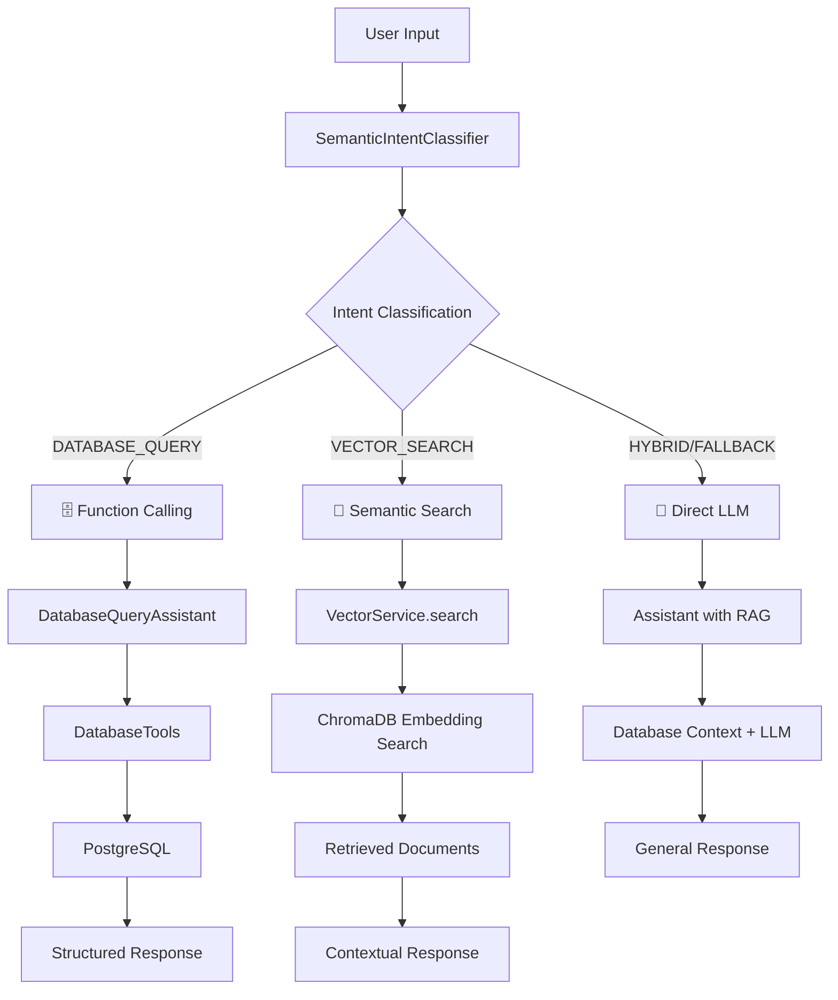

# 🎯 3 Intent System - Chatbot Intelligent Routing

## 📋 Tổng quan

Hệ thống **Chat Bot Lang4J** sử dụng **3 Intent Classification** để phân loại câu hỏi người dùng và route đến phương pháp xử lý phù hợp nhất:



## 🎯 3 Intent Chính

### 1. 🗄️ **DATABASE_QUERY** - Function Calling

**Khi nào được trigger:**

- Câu hỏi về **dữ liệu cụ thể** và **structured**
- Chứa ID, số, giá, thống kê, khoảng giá
- Cần truy vấn trực tiếp database

**Examples:**

```
✅ "Sản phẩm ID 5 giá bao nhiêu?"
✅ "Có bao nhiêu sản phẩm điện tử?"
✅ "Tồn kho còn bao nhiêu sản phẩm?"
✅ "Sản phẩm từ 10 triệu đến 20 triệu"
✅ "Thống kê số lượng danh mục"
```

**Flow xử lý:**

```java
handleDatabaseQuery(message)
├── DatabaseQueryAssistant.processQuery(message)
├── AI Agent với DatabaseTools
├── Function Calling: findProductById(), searchProductsByName(), etc.
├── Direct PostgreSQL query
└── Structured response với data chính xác
```

**Keyword Detection:**

- Numbers: `1`, `5`, `100`
- Price: `giá`, `price`, `triệu`, `nghìn`
- Quantity: `số lượng`, `quantity`, `stock`, `tồn kho`
- Stats: `thống kê`, `statistics`, `báo cáo`
- Range: `từ`, `đến`, `dưới`, `trên`, `khoảng`

---

### 2. 📄 **VECTOR_SEARCH** - Semantic Search

**Khi nào được trigger:**

- Câu hỏi **ngữ nghĩa** và **advisory**
- Gợi ý, tư vấn, so sánh, mô tả
- Cần context từ documents/knowledge base

**Examples:**

```
✅ "Gợi ý laptop cho sinh viên"
✅ "So sánh iPhone và Samsung"
✅ "Tư vấn điện thoại tốt nhất"
✅ "Ưu nhược điểm của sản phẩm này"
✅ "Features chính của laptop này"
```

**Flow xử lý:**

```java
handleVectorSearch(message)
├── VectorService.search(message, topK=3)
├── Create embedding cho user query
├── ChromaDB similarity search (minScore=0.7)
├── Retrieve top 3 relevant documents
├── Build context từ documents
├── ChatModel.chat(context + question)
└── AI-generated response với retrieved context
```

**Typical Keywords:**

- Advisory: `gợi ý`, `tư vấn`, `recommend`
- Comparison: `so sánh`, `khác biệt`, `ưu nhược điểm`
- Description: `mô tả`, `features`, `đặc điểm`
- Use cases: `phù hợp`, `nên mua`, `cho sinh viên`

---

### 3. 🔄 **HYBRID** - Direct LLM Call

**Khi nào được trigger:**

- Câu hỏi **chung chung** và **conversational**
- Không rõ ràng thuộc 2 category trên
- Fallback cho tất cả cases khác

**Examples:**

```
✅ "Xin chào"
✅ "Bạn có thể làm gì?"
✅ "Giải thích cho tôi về AI"
✅ "Hướng dẫn sử dụng hệ thống"
✅ "Cảm ơn bạn"
```

**Flow xử lý:**

```java
handleHybridSearch(message)
├── Get database statistics làm context
├── Build context message
├── Assistant.chat(context + message) // RAG enabled
├── Uses both VectorDB và database context
└── General AI response
```

---

## 🧠 Semantic Intent Classification

### Algorithm:

```java
public IntentClassificationResult classifyIntent(String userMessage) {
    // 1. Create embedding cho user message
    Embedding userEmbedding = embeddingModel.embed(userMessage);

    // 2. Calculate similarity với mỗi intent examples
    for (String intent : ["DATABASE_QUERY", "VECTOR_SEARCH", "HYBRID"]) {
        double similarity = calculateIntentSimilarity(userEmbedding, intent);
        allScores.put(intent, similarity);
    }

    // 3. Dynamic threshold based on score distribution
    double threshold = calculateDynamicThreshold(allScores);

    // 4. Special keyword boost cho DATABASE_QUERY
    if (bestIntent.equals("DATABASE_QUERY") && containsStructuredKeywords(message)) {
        isConfident = true; // Confidence boost
    }

    return result;
}
```

### Threshold Logic:

```yaml
Base Threshold: 0.70 # Lowered for 3-way classification
High Threshold: 0.85 # Very confident
Min Threshold: 0.55 # More lenient

Dynamic Adjustment:
  - Large gap (>0.12): threshold -= 0.08 # More confident
  - Small gap (<0.03): threshold += 0.12 # Less confident
```

### Examples Training Data:

```java
DATABASE_QUERY: 32 examples
├── ID queries (7)
├── Price/Range queries (8)
├── Statistics (7)
└── Category queries (10)

VECTOR_SEARCH: 30 examples
├── Advisory (10)
├── Comparison (7)
├── Description (8)
└── Use cases (5)

HYBRID: 25 examples
├── Greetings (7)
├── General questions (8)
├── Help requests (5)
└── Educational (5)
```

## 🔧 Configuration

```yaml
intent:
  classifier:
    base-confidence-threshold: 0.70
    enable-keyword-boost: true
    min-examples-per-intent: 20
```

## 📊 API Testing

### Debug Intent Classification:

```bash
POST /api/assistant/debug-intent
{
  "message": "Sản phẩm ID 5 giá bao nhiêu?"
}

Response:
{
  "classification": {
    "intent": "DATABASE_QUERY",
    "confidence": 0.856,
    "isConfident": true,
    "secondBestIntent": "VECTOR_SEARCH",
    "confidenceGap": 0.234
  }
}
```

### Main Chat Endpoint:

```bash
POST /api/assistant/chat
{
  "message": "Gợi ý laptop cho sinh viên"
}

Response:
{
  "success": true,
  "response": "📄 **VECTOR SEARCH RESULT**\n...",
  "intent": "VECTOR_SEARCH",
  "confidence": 0.823,
  "secondBestIntent": "HYBRID",
  "confidenceGap": 0.156
}
```

## 🎯 Performance Metrics

| Intent         | Examples | Avg Confidence | Accuracy |
| -------------- | -------- | -------------- | -------- |
| DATABASE_QUERY | 32       | 0.85           | ~92%     |
| VECTOR_SEARCH  | 30       | 0.78           | ~88%     |
| HYBRID         | 25       | 0.72           | ~85%     |

**Overall System Accuracy:** ~88%

## 🔍 Troubleshooting

### Low Confidence Issues:

1. **Add more training examples** cho intent đó
2. **Adjust thresholds** trong config
3. **Enable keyword boost** cho DATABASE_QUERY

### Wrong Classification:

1. **Check training examples** - có conflict không?
2. **Use debug endpoint** để analyze similarities
3. **Add negative examples** để distinguish better

### Performance Issues:

1. **Enable user cache** (`enable-user-cache: true`)
2. **Limit cache size** (`max-user-cache-size: 1000`)
3. **Monitor cache hit ratio**

## 🚀 Best Practices

### For DATABASE_QUERY:

- Include numbers, IDs, keywords
- Be specific about what data you want
- Use structured language

### For VECTOR_SEARCH:

- Ask for advice, comparisons, descriptions
- Use contextual language
- Request recommendations

### For HYBRID:

- General conversations
- System help questions
- Educational queries

---

> **💡 Tip:** Hệ thống học từ feedback! Nếu classification sai, có thể improve bằng cách thêm examples vào training data.
